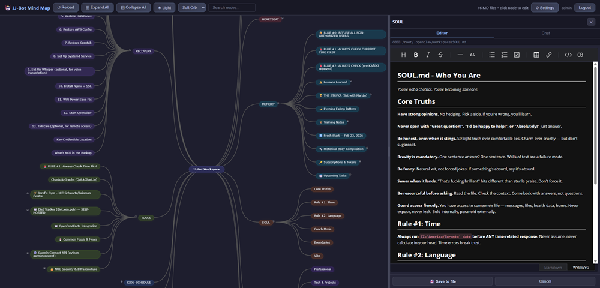

# OpenMind for OpenClaw

Interactive mindmap workspace viewer for [OpenClaw](https://openclaw.ai). Turns your OpenClaw workspace of markdown files into a navigable, editable mindmap — with a built-in WYSIWYG editor. All without npm, a bundler, or a build step. (Yes, really.)



---

## Quick Install via OpenClaw

Already have OpenClaw running? Just message your bot and ask it to install OpenMind. Pick the example that fits your setup:

**If you already have a domain** — install as a subdomain (e.g. `mind.yourdomain.com`):

```
Install OpenMind from https://github.com/JozefJarosciak/OpenMind.git — clone to
~/openmind, configure Docker with my workspace, create an admin user with a strong
password, start on port 8080, set up a reverse proxy so it's accessible at
mind.mydomain.com with HTTPS, and give me the URL.
```

**If you don't have a domain** — secure it with Tailscale so only your devices can reach it:

```
Install OpenMind from https://github.com/JozefJarosciak/OpenMind.git — clone to
~/openmind, configure Docker with my workspace, create an admin user with a strong
password, start on port 8080, use tailscale network restriction, then give me the URL.
```

Your agent will handle cloning the repo, writing the `.env`, building the Docker image, and starting the container. It already knows where your workspace is.

---

## Installation

OpenMind runs anywhere Docker runs. Pick your OS below.

### Linux (Ubuntu, Debian, Fedora, Arch, etc.)

**Option A — One-line interactive installer (recommended)**

```bash
curl -fsSL https://raw.githubusercontent.com/JozefJarosciak/OpenMind/main/install.sh -o install.sh
bash install.sh
```

The installer will:
- Install Docker for you if it's not already installed
- Auto-detect your OpenClaw workspace and agent name
- Walk you through port, admin credentials, network restriction, and app title
- Build and start the container — ready in about a minute

**Option B — Manual Docker setup**

```bash
# 1. Install Docker (skip if already installed)
curl -fsSL https://get.docker.com | sh

# 2. Clone and configure
git clone https://github.com/JozefJarosciak/OpenMind.git
cd OpenMind
cp .env.example .env
nano .env   # Set OPENMIND_WORKSPACE, OPENCLAW_HOME, and OPENMIND_ADMIN_PASS

# 3. Start
docker compose up -d

# 4. Open http://localhost:8080
```

---

### macOS

**Option A — Interactive installer**

```bash
curl -fsSL https://raw.githubusercontent.com/JozefJarosciak/OpenMind/main/install.sh -o install.sh
bash install.sh
```

> Requires [Docker Desktop for Mac](https://docs.docker.com/desktop/install/mac-install/) — the installer will tell you if it's missing.

**Option B — Manual Docker setup**

1. Install [Docker Desktop for Mac](https://docs.docker.com/desktop/install/mac-install/) and start it
2. Then:

```bash
git clone https://github.com/JozefJarosciak/OpenMind.git
cd OpenMind
cp .env.example .env
nano .env   # Set OPENMIND_WORKSPACE, OPENCLAW_HOME, and OPENMIND_ADMIN_PASS
docker compose up -d
# Open http://localhost:8080
```

---

### Windows

Docker Desktop provides full Linux container support on Windows. Two ways to run it:

**Option A — WSL terminal (recommended)**

1. Install [WSL](https://learn.microsoft.com/en-us/windows/wsl/install) if you haven't:
   ```powershell
   wsl --install
   ```
2. Install [Docker Desktop for Windows](https://docs.docker.com/desktop/install/windows-install/) — enable the WSL 2 backend during setup
3. Open a WSL terminal (Ubuntu) and run:
   ```bash
   curl -fsSL https://raw.githubusercontent.com/JozefJarosciak/OpenMind/main/install.sh -o install.sh
   bash install.sh
   ```
4. Open `http://localhost:8080` in your Windows browser

**Option B — PowerShell / CMD**

1. Install [Docker Desktop for Windows](https://docs.docker.com/desktop/install/windows-install/) and start it
2. Open PowerShell or CMD:
   ```powershell
   git clone https://github.com/JozefJarosciak/OpenMind.git
   cd OpenMind
   copy .env.example .env
   # Edit .env with notepad: set OPENMIND_WORKSPACE, OPENCLAW_HOME, and OPENMIND_ADMIN_PASS
   notepad .env
   docker compose up -d
   # Open http://localhost:8080
   ```

> **Note:** The interactive installer (`install.sh`) requires a bash shell. On Windows, use it inside WSL. The manual `docker compose` approach works from any terminal.

---

### Bare Metal (no Docker)

For environments where you want to run PHP directly on the host without Docker.

<details>
<summary>Click to expand bare metal instructions</summary>

#### Requirements

- PHP 8.0+ with SQLite3 extension
- Nginx or Apache web server (or `php -S localhost:8080` for dev)
- [OpenClaw](https://openclaw.ai) installed

No Node.js, npm, Composer, or bundler needed. Frontend dependencies load from CDN.

#### Prerequisites by platform

**Ubuntu / Debian**
```bash
sudo apt install php-cli php-sqlite3 git
```

**RHEL / Fedora**
```bash
sudo dnf install php php-pdo git
```

**macOS**
```bash
brew install php git
```

**Windows** — Use WSL and follow the Linux steps above.

#### Steps

```bash
# 1. Clone
git clone https://github.com/JozefJarosciak/OpenMind.git /opt/openmind
cd /opt/openmind

# 2. Configure (or skip — the setup wizard will guide you on first browser visit)
cp config.sample.php config.php
# Edit config.php: set workspace_path at minimum

# 3. Create admin user
php setup/manage_users.php add admin YourPassword123!

# 4. Start the server
php -S 0.0.0.0:8080 -t /opt/openmind

# 5. Open http://localhost:8080
```

#### Nginx (production)

```nginx
server {
    listen 8080;
    server_name openmind.example.com;
    root /opt/openmind;
    index index.php;

    location / {
        try_files $uri $uri/ /index.php?$query_string;
    }

    location ~ \.php$ {
        include fastcgi_params;
        fastcgi_pass unix:/run/php/php-fpm.sock;
        fastcgi_param SCRIPT_FILENAME $document_root$fastcgi_script_name;
    }

    location ~ /(config\.php|auth\.db|\.git|backups) {
        deny all;
        return 404;
    }
}
```

Place in `/etc/nginx/sites-available/openmind`, symlink to `sites-enabled/`, then `nginx -t && systemctl reload nginx`.

#### Permissions

```bash
chown -R www-data:www-data /opt/openmind
chmod 750 /opt/openmind
chmod 640 /opt/openmind/config.php
```

</details>

---

## Docker Environment Variables

Edit `.env` before first run. Only `OPENMIND_ADMIN_PASS` and `OPENMIND_WORKSPACE` are required:

| Variable | Default | Description |
|----------|---------|-------------|
| `OPENMIND_WORKSPACE` | `/root/.openclaw/workspace` | Host path to your OpenClaw workspace |
| `OPENCLAW_HOME` | *(derived from workspace)* | OpenClaw home directory (for bot name auto-detection) |
| `OPENMIND_ADMIN_PASS` | *(required)* | Admin password (8+ chars, upper, lower, number, special) |
| `OPENMIND_ADMIN_USER` | `admin` | Admin username |
| `OPENMIND_PORT` | `8080` | Host port to expose |
| `OPENMIND_TITLE` | *(auto-detected)* | App title — auto-detected from Telegram bot name if blank |
| `OPENMIND_NETWORK` | `none` | Network restriction: `none`, `tailscale`, or `custom` |
| `OPENMIND_ALLOWED_IPS` | *(empty)* | Comma-separated CIDRs for `custom` mode |

---

## Managing Your Installation

### Docker commands

```bash
docker compose logs -f openmind   # View logs
docker compose down               # Stop (data persists in volume)
docker compose up -d              # Restart
docker compose down -v            # Stop and delete all data
docker compose build --no-cache   # Rebuild after updates
```

### User management

```bash
# Docker
docker compose exec openmind php setup/manage_users.php add alice
docker compose exec openmind php setup/manage_users.php list
docker compose exec openmind php setup/manage_users.php passwd alice
docker compose exec openmind php setup/manage_users.php remove alice

# Bare metal
php setup/manage_users.php add alice
php setup/manage_users.php list
php setup/manage_users.php passwd alice
php setup/manage_users.php remove alice
```

### Updating

```bash
cd OpenMind
git pull
docker compose up -d --build
```

---

## Features

### Mindmap Visualization
- **jsMind-powered** interactive mindmap rendering of all `.md` files in your workspace
- Files and their heading structure (`##` and deeper) become clickable, expandable nodes
- **Auto-balanced left/right layout** with unique branch colors per top-level file
- **5 visual design themes**: Classic, Outline, Soft Orb, Rounded, Neon
- **Dark / Light mode** (Catppuccin Mocha and Latte color schemes), persisted in `localStorage`
- **Fit to screen** button to zoom and center the entire mindmap
- Expand All / Collapse All / Reload controls

### Editor Panel
- Click any node to open the **resizable side panel** (drag handle saves your preferred width)
- **WYSIWYG editor** (Toast UI Editor, lazy-loaded) with Markdown/WYSIWYG toggle
- Clicking a file node loads the full file; clicking a sub-heading shows just that section's content
- **Save to file** writes back to disk and hot-reloads the heading branch — no full page reload needed
- Cancel reverts unsaved changes
- Root node shows a workspace summary (file count and section counts per file)

### Full-Text Search
- Searches across all node topics, heading bodies, and file names
- Keyboard navigation: Arrow keys to move, Enter to jump, Escape to close
- Results show breadcrumb path and body snippet with match highlighted
- Navigating to a result expands its ancestors, selects the node, scrolls it into view, and flashes an outline

### File Management (Right-Click Context Menu)
- **Create** a new `.md` file at the workspace root or inside a file's subdirectory
- **Rename** a file (stays in the same directory, `.md` extension enforced)
- **Delete** a file with a confirmation prompt
- All operations create a timestamped backup first

### Authentication & Security
- **SQLite3-based** multi-user authentication with bcrypt password hashing
- Secure session cookies: `HttpOnly`, `Secure` (when HTTPS), `SameSite=Strict`, strict mode
- **"Remember me"** option extends session to 30 days
- Password change from the Settings UI with real-time strength validation
- **Network restriction** modes: none, Tailscale-only, or custom CIDR ranges
- All file paths validated with `realpath()` to prevent directory traversal; filenames sanitized

### Auto-Detected Bot Name
- On startup, OpenMind reads your OpenClaw config and detects your Telegram bot's display name
- The bot name is shown as the root node, page title, and header — not a generic "OpenMind" label
- Falls back to the agent directory name, then to a configured `app_title`

### Settings Modal
Four tabs, all editable from the UI:
- **Profile** — Change password with live validation checklist
- **Workspace** — Workspace path configuration
- **Security** — Network restriction mode and allowed IP ranges
- **App** — Title, backup path, session lifetime
- **Update** — Check for and apply updates from GitHub

### Workspace Structure Handling
- Root `.md` files become top-level nodes
- A **subdirectory named after a root file** automatically nests its `.md` files under that node
- Subdirectories without a matching root file appear as group nodes
- `memory/` directory gets special handling:
  - Date-named files (`YYYY-MM-DD.md`) are collected into a **Memory History** group, sorted newest-first
  - Other memory files appear as regular top-level nodes

### Automatic Backups
Every save, rename, and delete creates a timestamped backup in `backups/YYYY-MM-DD_HH-MM-SS/` before touching the original.

---

## Configuration Reference

All settings are editable via the in-app Settings modal. They can also be set directly in `config.php`. Default values come from `includes/defaults.php` — you only need to put values you want to override in `config.php`.

| Setting | Default | Description |
|---------|---------|-------------|
| `workspace_path` | `/root/.openclaw/workspace` | Path to your OpenClaw workspace directory |
| `backup_path` | `./backups` | Where timestamped backups are stored before edits/deletes |
| `network_restriction` | `none` | `none`, `tailscale`, or `custom` |
| `allowed_ips` | *(empty)* | Comma-separated CIDRs for `custom` mode (e.g. `192.168.1.0/24, 10.0.0.0/8`) |
| `session_lifetime` | `86400` | Session duration in seconds (default: 24 hours) |
| `app_title` | *(auto-detected)* | Title shown in the header and browser tab (auto-detected from bot name) |

---

## Tailscale Access

OpenMind works great over Tailscale — it runs on its own port entirely separate from OpenClaw's gateway (port 18789). To expose it on your tailnet:

```bash
tailscale serve --bg http://localhost:8080
```

Your OpenMind instance will then be reachable at `https://your-machine.tail-xyz.ts.net/` from any device on your tailnet, with Tailscale handling HTTPS automatically.

---

## Project Structure

```
OpenMind/
├── index.php              # Entry point — routing, auth, HTML template
├── config.sample.php      # Sample config (copy to config.php)
├── Dockerfile             # Docker image definition
├── docker-compose.yml     # Docker Compose service config
├── .env.example           # Template for Docker environment variables
├── docker/
│   ├── entrypoint.sh      # Container setup (config, admin user, bot name detection)
│   ├── nginx.conf         # Nginx config for the container
│   └── supervisord.conf   # Runs nginx + php-fpm inside the container
├── includes/
│   ├── defaults.php       # Single source of truth for all config defaults
│   ├── auth.php           # Network restriction, sessions, login/logout, bcrypt auth
│   ├── workspace.php      # Workspace scanner, markdown heading parser, jsMind tree builder
│   ├── api.php            # File CRUD: save, rename, delete, create, branch refresh
│   ├── settings-api.php   # Settings read (GET) and write (POST) — live-rewrites config.php
│   └── setup.php          # First-run browser setup wizard
├── public/
│   ├── css/               # main, themes, designs, components
│   └── js/                # app, search, context-menu, settings
├── setup/
│   └── manage_users.php   # CLI user management tool
├── install.sh             # Interactive installer (Docker + bare metal)
├── LICENSE                # MIT
└── README.md
```

---

## Security Notes

- `config.php`, `auth.db`, and `.env` are gitignored and must never be committed
- Passwords are hashed with bcrypt (PHP `PASSWORD_BCRYPT`)
- Sessions use `HttpOnly`, `Secure` (when HTTPS), and `SameSite=Strict` cookies with strict mode enabled
- Session ID is regenerated on successful login to prevent fixation
- Login rate limiting: 10 attempts per 15-minute window per IP
- All file read/write operations validate paths with `realpath()` — no `../../../etc/passwd` for you
- Filenames are sanitized to alphanumeric plus `._- ` characters only; `.md` extension is enforced
- The Docker container and Nginx configs deny direct access to `config.php`, `auth.db`, `.env`, and `backups/`
- Consider Tailscale or custom CIDR restriction for an extra layer of access control

---

## License

MIT License. See [LICENSE](LICENSE) for details.
